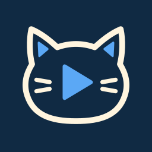
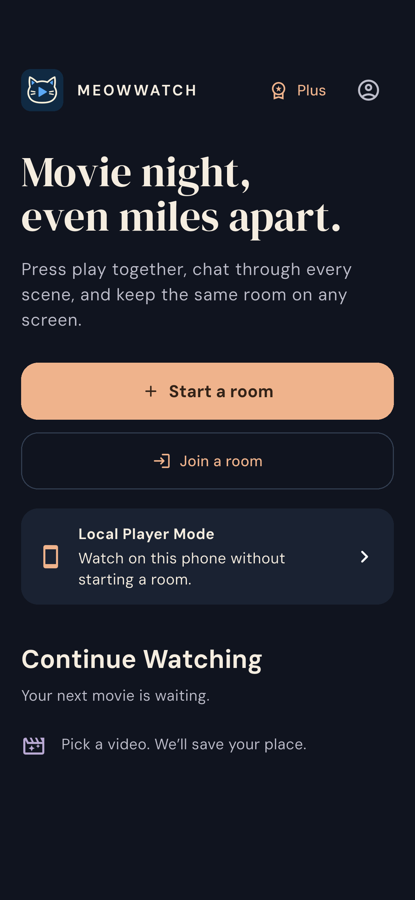

# MeowWatch Mobile

**Movie night, even when you're miles apart.**



Android-first MeowWatch: synchronized playback, conversation, and nearby desktop control for couples, friends, and small groups.

This is the mobile counterpart to [MeowWatch for desktop](https://github.com/PeterShanxin/MeowWatch), with a new touch interface, Android playback, lifecycle handling, and subscription flow. **Active development: not yet submission-ready.** See the [acceptance ledger](docs/STATUS.md) for verified capabilities and remaining work.

<p></p>

Actual Android emulator capture. [Original screenshot and source record](assets/submission/README.md).

When a video is loaded on this device, **Enter full screen** expands the player
and hides the system bars. Handsets request landscape; tablets keep their
current orientation. Tap the picture to show controls. Paused playback and
accessible navigation keep controls available. Back first exits full screen
while preserving the current video and room. Keyboard navigation reveals the
controls and keeps focused controls available; returning to touch restores their
automatic hiding during playback.

## Development

Requires Flutter 3.44.0 / Dart 3.12, Java 17 or later, and the Android SDK. Android is the validation target; iOS scaffolding is present but not yet validated.

```sh
flutter pub get
flutter analyze
flutter test
flutter run -d <android-device>
flutter build apk --debug
```

The Android player is pinned in `third_party/video_player_android`. Its small
native extension keeps Together playback paused after a brief audio-focus
interruption, while Local Mode can resume after transient focus returns. Each
player has one focus owner that handles system callbacks directly. See its
[provenance and patch notes](third_party/video_player_android/VENDOR.md).
The **Check** workflow also builds the normal APK and runs the player's native
unit suite. That suite needs **Java 21** for its Android SDK 36 Robolectric
sandbox; the app itself still builds with Java 17.

The standalone Nearby packages have their own development dependencies and a
required CI job. To run those checks locally as well:

```sh
cd packages/nearby_bridge
dart pub get --enforce-lockfile
dart analyze --fatal-infos
dart test
cd ../nearby_platform
flutter pub get --enforce-lockfile
flutter analyze --no-pub
flutter test --no-pub
```

For actual same-host LAN TLS client tests, set `NEARBY_TEST_ADDRESS` and
`NEARBY_TEST_PREFIX` to an address/prefix assigned to a local private adapter.
CI selects one from its real interfaces. Without these, the explicitly marked
LAN cases are skipped; that is not cross-device discovery proof.

The default **debug build** uses the configured RevenueCat **Test Store**.
Its native purchase dialog offers sandbox outcomes and makes no real charge.
The app loads the actual SDK Offering and `meowwatch_plus` entitlement; it does
not grant premium access locally. To use your own configured project, pass
`--dart-define=REVENUECAT_API_KEY=<public-sdk-key>` and follow
[RevenueCat setup](docs/REVENUECAT_SETUP.md). An empty key reports unavailable
billing. Never publish a Play Store build with the Test Store key, and keep
secret/server keys and signing credentials out of the client and repository.
Release/profile builds default to purchases unavailable until a platform SDK
key is supplied. They reject Test Store keys before SDK initialization. Use
the normal debug APK for the Shipaton Test Store demo.

Windows ARM hosts currently lack official local Android Emulator support. Use an attached Android device or the project's hosted Linux emulator workflow when available; the Android build toolchain and ADB are separate from emulator support.

## Product contract

- Host one **real Together Session per local day** for free. Creating an empty room does not consume it.
- Guests join free. Reconnection and playback-target changes continue the same session.
- RevenueCat `meowwatch_plus` unlocks unlimited hosting.
- Local user-selected files and supported direct media URLs; no DRM bypass.
- A skippable first-use guide, replay from Settings, and a one-tap licensed
  Sintel sample trailer in the video picker.
- Syncplay transport fails closed. Nearby control requires explicit authenticated pairing.

See [product specification](docs/PRODUCT_SPEC.md), [delivery goal](docs/GOAL_BRIEF.md), and [status](docs/STATUS.md).

## Try a movie night

1. Open the app and choose the name your room companions will see.
2. Choose **Start a room**, then share its invitation. A second person opens
   **Join a room** and pastes the invitation or taps **Scan invite QR**. Opening
   a `meowwatch://join` link also works. Review the room and server before joining.
3. Each person opens the same video file or direct video URL. MeowWatch
   synchronizes playback controls; it does not upload or send local video files.
4. Use Play, Pause and the timeline from either phone. Open Chat for messages
   and reactions. Leaving and returning through Continue Watching restores the
   accepted source and saved position.

Choose **Local mode** to watch alone. The screen selector includes this phone,
[Nearby MeowWatch](docs/NEARBY_PROTOCOL.md), and [Google Cast](docs/CAST.md).
Nearby requires the companion implementation in
[desktop draft PR 279](https://github.com/PeterShanxin/MeowWatch/pull/279), explicit
pairing approval, and a trusted private LAN. Cast accepts public HTTPS MP4 links
without URL parameters; receiver hardware acceptance is still pending. Ordinary
webpages and protected streaming services are not direct video sources.
See [media source support](docs/MEDIA_SOURCE_SUPPORT.md) for supported inputs,
codec limits and the evaluated webpage-extraction boundary.

Android's Share/Open menu can propose a direct video link or a granted video
file; MeowWatch asks before opening it. In Chat, a peer's standalone video URL
has a **Watch this too** review action. **Recent rooms** starts a new movie
night with a saved video, while **Continue Watching** resumes the original
session. Appearance and Movie night reactions use the real Plus entitlement.

Losing the room connection pauses playback. Rejoining keeps the same room and
daily allowance. If the phone's network video also failed, MeowWatch attempts
one paused reopening from its retained position; it does not restart the movie
automatically. If reopening fails, use **Choose another video** to open it again.

## Verification and submission

CI runs the app and standalone package checks, native playback, RevenueCat,
SAF file access, Nearby transport and storage, five rendered Android viewports,
and independent phone/tablet journeys. The
[acceptance ledger](docs/STATUS.md) distinguishes passing evidence from remaining
failures and hardware checks. Native recordings and screenshots are retained as
GitHub Actions artifacts; an artifact from a failed job is development evidence.

The [demo script and 94-second frozen-source edit](docs/DEMO_SCRIPT.md),
[English submission draft](docs/SUBMISSION_DRAFT.md), and
[verified submission requirements](docs/SUBMISSION_REQUIREMENTS.md) track the
remaining submission work. The local [showcase](tools/showcase/README.md) can
display actual ADB frames or explicitly labeled captured evidence while recording
the development canvas.

The [submission artwork](assets/submission/README.md) contains the Devpost cover
and native screenshot provenance. The [demo editor](tools/submission_demo/README.md)
composes original recordings at normal speed and preserves their source hashes
and approximate dual-device timing; it does not turn a failed test into accepted
product evidence.

## License

The [icon kit](docs/BRAND.md) includes the editable flat cat-and-play mark,
Android adaptive and themed icons, desktop ICO, and small-size exports. The
launcher and in-app brand marks use the selected navy, cream and blue design.

[AGPL-3.0-only](LICENSE). Portable desktop code retains its original notices and provenance. Third-party packages retain their respective licenses; see [third-party notices](THIRD_PARTY_NOTICES.md) and Settings → About & licenses in the app.
